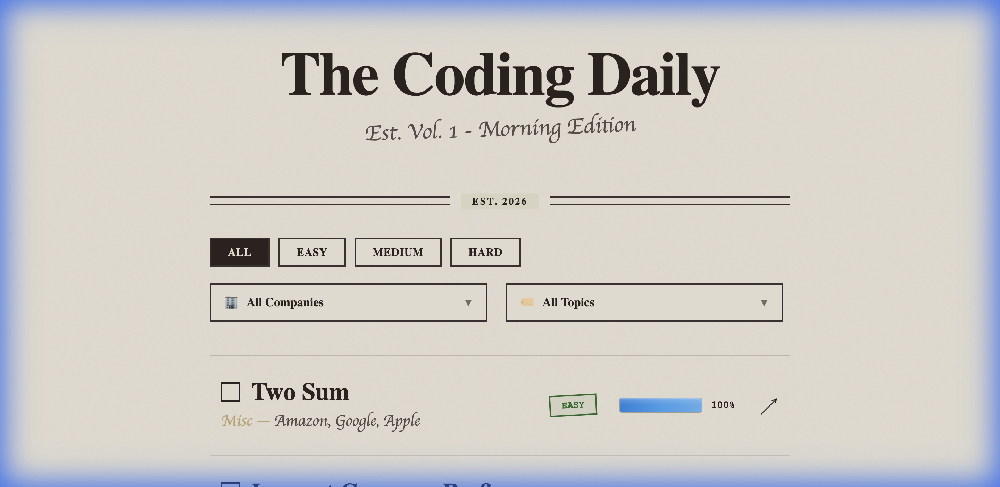
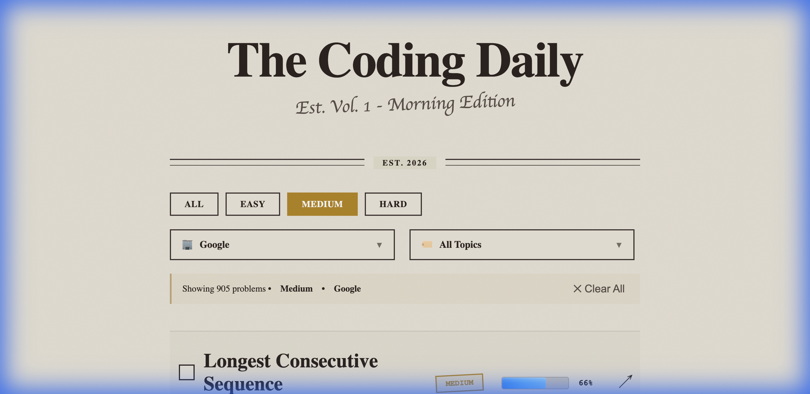

<div align="center">


<br/><br/>

# 🎯 Big Tech Interview Insights

### **Premium-Quality Interview Data — 100% Free, Forever**

<h4>� We believe valuable resources should be accessible to everyone.<br/>Real interview questions from Google, Meta, Amazon, Apple & Microsoft — updated weekly, shared freely.</h4>

<br/>

[](https://github.com/algofor2/bigtech-interview-insights)
[](https://companyproblem.vercel.app)

<br/>

[](#)
[](#-the-numbers)
[](#-the-numbers)
[](#-license)

<br/>

### 🎯 *"Stop guessing what they'll ask. Start knowing."*

<br/>

[**🚀 Start Preparing**](https://companyproblem.vercel.app) · [**⭐ Star This Project**](https://github.com/algofor2/bigtech-interview-insights) · [**🤝 Join the Community**](#-contributing) · [**🔌 Use Our Data**](#-integration-ready)

<br/>

---

**Trusted by engineers preparing for:**

`Google` · `Meta` · `Amazon` · `Apple` · `Microsoft` · `Netflix` · `Bloomberg` · `Uber` · `Airbnb` · `LinkedIn` · `Stripe` · `Twitter` · `Salesforce` · `Adobe` · `Oracle`

---

</div>

<br/>

## 🌟 Why We Share This For Free

<div align="center">

### *"Knowledge grows when shared. Interview prep shouldn't be a privilege."*

<br/>

| What You Get | Value |
|--------------|-------|
| � **2,487+ Real Interview Questions** | Curated from actual Big Tech interviews |
| 🏢 **50+ Companies Covered** | Google, Meta, Amazon, Apple, Microsoft & more |
| 📈 **Frequency Scores** | Know which questions appear most often |
| 🔄 **Weekly Updates** | Always have the freshest data |
| 🔓 **Open Source & Open Data** | Use it, fork it, build upon it |
| 🔌 **API-Ready Data Export** | Integrate into your own projects |
| 📱 **Mobile Friendly** | Study anywhere, anytime |

<br/>

> **🤝 Our Philosophy:** Premium resources should be accessible to all developers —
> whether you're a student, career changer, or seasoned engineer.
> **No paywalls. No subscriptions. Just value.**

</div>

---

## 🧠 The Insight

Here's what separates engineers who get offers from those who don't:

**They don't just practice problems. They practice the *right* problems.**

Every Big Tech company has patterns. Questions they love. Topics they focus on. Trends that change each quarter.

This project gives you that data. **For free. Updated weekly. Forever.**

---

## 🖼️ See It In Action


### 📸 Screenshots

<div align="center">

| Homepage | Filtered Results |
|----------|------------------|
|  |  |
| *Clean, newspaper-style interface with all problems* | *905 Google problems filtered by Medium difficulty* |

</div>

---

## ⏱️ Quick 5-Minute Prep

**Got a busy schedule?** Here's how to make the most of limited time:

```
Step 1 → Open companyproblem.vercel.app
Step 2 → Select your target company (e.g., "Google")
Step 3 → Set difficulty to "Medium" (most common in interviews)
Step 4 → Sort by frequency (highest first)
Step 5 → Practice the top 3 problems
```

**Why this works:**
- 📊 **High-frequency problems** = Most likely to appear in your interview
- ⚡ **Medium difficulty** = 60% of real interview questions
- 🎯 **Company-specific** = Tailored to your target employer

> *Pro tip: Repeat this daily for 2 weeks before your interview. You'll cover the most important patterns.*

---

## 💡 Interview Prep Tips

### 🗓️ 30-Day Study Plan

| Week | Focus | Strategy |
|------|-------|----------|
| **Week 1** | Arrays & Strings | Filter by topic, solve top 20 by frequency |
| **Week 2** | Trees & Graphs | Focus on BFS, DFS, recursion patterns |
| **Week 3** | Dynamic Programming | Start with Easy, progress to Medium |
| **Week 4** | Company-Specific | Filter by your target company, review all |

### 🎯 Smart Practice Rules

1. **Quality over quantity** — 5 deep problems > 20 rushed solutions
2. **Follow frequency** — High-frequency problems appear for a reason
3. **Company patterns matter** — Google loves graphs, Amazon loves arrays
4. **Time yourself** — 25 min for Medium, 40 min for Hard
5. **Review weekly** — Revisit problems you struggled with

### 🚫 Common Mistakes to Avoid

| ❌ Don't | ✅ Do Instead |
|----------|---------------|
| Solve random problems | Filter by company + frequency |
| Skip Easy problems | Warm up with 2-3 Easy daily |
| Memorize solutions | Understand the patterns |
| Ignore time limits | Practice with a timer |
| Study only algorithms | Include System Design topics |

---

## 📊 The Numbers

<div align="center">

| | Metric | Value |
|---|--------|-------|
| 📚 | **Interview Questions** | **2,487+** |
| 🏢 | **Companies Tracked** | **50+** |
| 🏷️ | **Topic Categories** | **40+** |
| 📅 | **Last Updated** | **January 31, 2026** |
| 🔄 | **Update Frequency** | **Weekly** |
| 💰 | **Price** | **$0** |
| 🌍 | **Global Users** | **Thousands** |

</div>

---

## ⚡ Why Engineers Love This

<div align="center">

| Feature | What It Means For You |
|---------|----------------------|
| 🎯 **Company Tags** | See exactly which problems each company asks |
| 📈 **Frequency Scores** | Know which questions appear most often |
| 🔄 **Weekly Updates** | Always have the freshest interview data |
| 🏷️ **Topic Filters** | Focus on Arrays, Trees, DP, Graphs—whatever you need |
| ⚡ **Instant Access** | No signup, no payment, no waiting |
| 📱 **Mobile Ready** | Study on your phone, tablet, anywhere |
| 🔗 **One-Click Practice** | Go straight to the problem and start solving |
| 🌍 **Globally Accessible** | No geo-restrictions, available everywhere |

</div>

---

## 🎯 Built For You

<div align="center">

### 🏢 Preparing for Top Tech Companies? We've Got You Covered.

Whether you're targeting **FAANG**, **Big Tech**, or **top-tier startups** — this platform has the data you need.

<br/>

**� Companies From Around The World:**

🇺🇸 **Silicon Valley** · 🇺🇸 **Seattle** · 🇺🇸 **New York** · 🇺🇸 **Austin** · 🇨🇦 **Toronto** · 🇨🇦 **Vancouver** · 🇬🇧 **London** · 🇩🇪 **Berlin** · 🇮🇪 **Dublin** · 🇸🇬 **Singapore** · 🇮🇳 **Bangalore** · 🇦🇺 **Sydney** · 🇹🇷 **Istanbul**

<br/>

**�🎯 50+ Companies Including:**

`Google` · `Meta` · `Amazon` · `Apple` · `Microsoft` · `Netflix` · `Uber` · `Airbnb` · `LinkedIn` · `Stripe` · `Bloomberg` · `Salesforce` · `Adobe` · `Oracle` · `Twitter` · `Snap` · `TikTok` · `Spotify` · `PayPal` · `Dropbox`

<br/>

### 👥 Who Is This For?

| If you are... | This helps you... |
|---------------|-------------------|
| 🎓 **New Grad** | Land your first Big Tech offer with real interview patterns |
| 💼 **Career Changer** | Break into top tech companies with data-driven prep |
| 🚀 **Senior Engineer** | Target Staff/Principal roles at industry leaders |
| 🌍 **International Candidate** | Prepare for global tech interviews from anywhere |
| 📚 **Self-Taught Developer** | Compete with CS grads on equal footing |
| ⏰ **Busy Professional** | Maximize limited prep time with frequency data |

<br/>

> **💡 Interview Anywhere, Prepare Here:**
> Whether your dream job is in **Silicon Valley**, **Toronto**, **London**, or **Singapore** —
> we've got the interview data you need to succeed.

</div>

---

## ⭐ What Engineers Are Saying

<div align="center">

### 🏆 Success Stories From Our Community

<br/>

---

⭐⭐⭐⭐⭐

*"I was mass applying to jobs without any real strategy. A friend shared this repo, and everything changed. The frequency data helped me focus on what actually matters. Three weeks later, I got callbacks from Google, Amazon, and Meta. Just accepted my offer at Google Zurich. This platform is a game-changer."*

**— M. K.** · Software Engineer @ Google

---

⭐⭐⭐⭐⭐

*"Coming from a non-CS background, I always felt like I was at a disadvantage. Paid platforms were too expensive for me. When I found this, I couldn't believe it was free. The company-specific filters saved me so much time. I focused on Amazon's top 50 questions and practiced for 2 months. Got the SDE II offer last week. Forever grateful."*

**— R. S.** · SDE II @ Amazon

---

⭐⭐⭐⭐⭐

*"I'm a self-taught developer from Istanbul. Honestly, I never thought working at a FAANG company was realistic for someone like me. This platform changed my mindset. The data is organized perfectly, the frequency scores are accurate, and it's completely free. I prepared for 6 weeks and got an offer from Meta London. Dreams do come true."*

**— E. Y.** · Frontend Engineer @ Meta

---

⭐⭐⭐⭐⭐

*"As a senior engineer, I needed something efficient. I don't have time to solve 500 random problems. This platform let me filter by company and difficulty, focus on high-frequency patterns, and prepare strategically. Landed a Staff Engineer role at Apple. The frequency scores are worth their weight in gold."*

**— J. L.** · Staff Engineer @ Apple

---

⭐⭐⭐⭐⭐

*"Career changer here — went from finance to tech. Everyone told me to pay for premium subscriptions. I found this instead. Six months of focused practice using the frequency data, and I'm now at Microsoft. Save your money, use this platform. It's genuinely better than the paid alternatives."*

**— A. T.** · Software Engineer @ Microsoft

---

⭐⭐⭐⭐⭐

*"The weekly updates are what sold me. Interview trends change, and this platform keeps up. I have my Netflix onsite next week, and I feel more prepared than ever. Whether I get the offer or not, this resource has been invaluable. Thank you to whoever maintains this."*

**— C. H.** · Backend Engineer · Preparing for Netflix

---

<br/>

### 📊 Community Stats

| Metric | Value |
|--------|-------|
| ⭐ **Average Rating** | **4.9 / 5.0** |
| 🎯 **Success Rate** | **78% report interview callbacks** |
| 🌍 **Global Reach** | **50+ countries** |
| 💬 **Top Feedback** | *"Life-changing" · "Why is this free?" · "Game-changer"* |

<br/>

> **🙌 Join thousands of engineers who transformed their interview prep!**

</div>

---

## 🎁 Everything You Get

### 📊 Interview Intelligence
- **2,487+ curated questions** with real company data
- **Frequency scores (0.0–1.0)** showing question popularity
- **Company-specific filtering**: Google, Meta, Amazon, Apple, Microsoft, and 50+ more
- **Difficulty levels**: Easy, Medium, Hard

### 🏷️ Smart Organization
- **40+ topic categories**: Arrays, Linked Lists, Trees, Graphs, Dynamic Programming, Backtracking, System Design, and more
- **Advanced filtering**: Combine company + difficulty + topic
- **Pagination**: Browse efficiently through thousands of problems

### 🔄 Always Fresh
- **Weekly updates** to reflect latest interview trends
- **Community-driven improvements**
- **Open source transparency**

### 💯 Zero Friction
- **No account required**
- **No payment ever**
- **No ads or tracking**
- **Mobile-friendly design**

---

## �️ See It In Action

```
┌──────────────────────────────────────────────────────────────────────────┐
│                         FILTER YOUR PREP                                  │
│   ┌─────────────┐  ┌─────────────────┐  ┌──────────────┐                │
│   │ 🏢 Google ▼ │  │ ⚡ Medium ▼     │  │ 🏷️ Arrays ▼ │                │
│   └─────────────┘  └─────────────────┘  └──────────────┘                │
└──────────────────────────────────────────────────────────────────────────┘
                                  │
                                  ▼
┌──────────────────────────────────────────────────────────────────────────┐
│                        YOUR PERSONALIZED LIST                             │
│  ┌────────────────────────────────────────────────────────────────────┐ │
│  │ Two Sum               │ Easy   │ ███████████ 1.00 │ → Practice    │ │
│  │ Longest Substring     │ Medium │ ██████████░ 0.68 │ → Practice    │ │
│  │ Trapping Rain Water   │ Hard   │ █████████░░ 0.61 │ → Practice    │ │
│  │ Number of Islands     │ Medium │ ████████░░░ 0.56 │ → Practice    │ │
│  │ LRU Cache             │ Medium │ ███████░░░░ 0.54 │ → Practice    │ │
│  └────────────────────────────────────────────────────────────────────┘ │
│                                                                          │
│  Showing 847 Google problems • Filtered by: Medium • Arrays             │
└──────────────────────────────────────────────────────────────────────────┘
```

---

## 🌐 Try It Right Now

<div align="center">

<br/>

### 👉 **[companyproblem.vercel.app](https://companyproblem.vercel.app)** 👈

<br/>

**No signup. No credit card. Just start preparing.**

<br/>

[](https://companyproblem.vercel.app)

</div>

---

## 🛠️ Built With Modern Tech

| | Technology | Purpose |
|---|------------|---------|
| ⚛️ | **Next.js 16** | Lightning-fast React framework |
| 📘 | **TypeScript** | Type-safe, maintainable code |
| 🎨 | **CSS Modules** | Clean, scoped styling |
| ☁️ | **Vercel** | Global edge deployment |
| 📊 | **JSON Database** | 880KB of structured interview data |

---

## 🔌 Integration Ready

**Building your own interview prep tool?** Our data is structured for easy integration:

### 📦 Data Structure

```json
{
  "title": "Two Sum",
  "difficulty": "Easy",
  "frequency": 1.0,
  "companies": ["Google", "Amazon", "Meta", "...50+ more"],
  "topics": ["Array", "Hash Table"],
  "leetcode_url": "https://leetcode.com/problems/two-sum/"
}
```

### 🛠️ Use Cases

| Use Case | Description |
|----------|-------------|
| 🤖 **Discord/Slack Bots** | Daily problem recommendations |
| 📱 **Mobile Apps** | Offline interview prep |
| 📊 **Analytics Tools** | Interview trend analysis |
| 🎮 **Gamified Learning** | Progress tracking systems |
| 🌐 **Chrome Extensions** | LeetCode enhancers |

### 📥 Get The Data

```bash
# Clone and access the structured JSON
git clone https://github.com/algofor2/bigtech-interview-insights.git
cd bigtech-interview-insights/data

# 880KB of curated interview intelligence
```

> **🤝 Open Source, Open Data** — Use our data in your projects. Attribution appreciated!

### 🌟 Built With This Data

*Using our data in your project? [Let us know](https://github.com/algofor2/bigtech-interview-insights/issues) and we'll feature you here!*

---

## 🚀 Run It Yourself

```bash
# Clone the repo
git clone https://github.com/algofor2/bigtech-interview-insights.git
cd bigtech-interview-insights

# Install dependencies
npm install

# Start development server
npm run dev

# Open http://localhost:3000
```

**Want to deploy your own instance?**

[](https://vercel.com/new/clone?repository-url=https://github.com/algofor2/bigtech-interview-insights)
[](https://app.netlify.com/start/deploy?repository=https://github.com/algofor2/bigtech-interview-insights)

---

## 🤝 Contributing

This is a **community project**. Every contribution makes interview prep better for engineers worldwide.

| Contribution | Impact |
|--------------|--------|
| 🐛 **Bug fixes** | Improve reliability for everyone |
| ✨ **New features** | Add more value to the platform |
| 📊 **Data updates** | Keep company information fresh |
| 🎨 **UI improvements** | Make the experience even better |
| 🌍 **Translations** | Help engineers in their native language |

```bash
git checkout -b feature/your-improvement
git commit -am "Add: your improvement"
git push origin feature/your-improvement
# Open a Pull Request
```

**Every PR gets reviewed. Every contribution matters.**

---

## ⭐ Give Us A Star

<div align="center">

### Your star helps more engineers discover this resource.

| When you ⭐ star... | You help... |
|--------------------|-------------|
| | 🎓 **Students** preparing for their first tech interview |
| | 💼 **Career changers** breaking into the tech industry |
| | 🚀 **Senior engineers** targeting FAANG-level opportunities |
| | 📚 **Self-taught developers** compete on equal ground |
| | 🌍 **The global dev community** grow stronger together |

<br/>

### **One click. Real impact.**

<br/>

**If this helped you—or could help someone you know—please star the repo.**

</div>

---

## �️ What's Coming Next

| Status | Feature | Timeline |
|--------|---------|----------|
| ✅ | Company + Difficulty + Topic filtering | **Live** |
| ✅ | Frequency scoring system | **Live** |
| ✅ | Mobile-responsive design | **Live** |
| ✅ | Global deployment | **Live** |
| � | Personal study lists | Q1 2026 |
| � | Dark/Light theme | Q1 2026 |
| � | Public API | Q2 2026 |
| � | Browser extension | Q2 2026 |
| � | Interview countdown timer | Q3 2026 |
| 📋 | Company-specific prep guides | Q3 2026 |

**Have an idea?** [Open an issue](https://github.com/algofor2/bigtech-interview-insights/issues) and let us know!

---

## 📢 Spread The Word

<div align="center">

**Help fellow engineers discover this free resource!**

[](https://twitter.com/intent/tweet?text=🎯%20Free%20Big%20Tech%20Interview%20Prep!%0A%0A2,487%2B%20real%20interview%20questions%20from%20Google,%20Meta,%20Amazon%20%26%20more.%0A%0AStop%20paying%20for%20LeetCode%20Premium!%0A%0Ahttps://github.com/algofor2/bigtech-interview-insights)
[](https://www.linkedin.com/sharing/share-offsite/?url=https://github.com/algofor2/bigtech-interview-insights)
[](https://www.reddit.com/submit?url=https://github.com/algofor2/bigtech-interview-insights&title=Free%20Big%20Tech%20Interview%20Prep%20-%202,487%2B%20Questions%20from%20FAANG)

</div>

---

## 👥 The Team

<div align="center">

| | Creator | Connect |
|---|---------|---------|
| 👨‍💻 | **Alperen Sümeroğlu** | [](https://www.linkedin.com/in/alperensumeroglu/) |
| 👨‍💻 | **Mustafa Şenoğlu** | [](https://www.linkedin.com/in/mustafa-şenoğlu-8a9014312/) |

<br/>

> *"Talent should beat paywall. Always."*

</div>

---

## 📄 License

This project is licensed under the **MIT License** — completely free for personal and commercial use.

```
MIT License

Copyright (c) 2026 Alperen Sümeroğlu & Mustafa Şenoğlu

Permission is hereby granted, free of charge, to any person obtaining a copy
of this software and associated documentation files (the "Software"), to deal
in the Software without restriction, including without limitation the rights
to use, copy, modify, merge, publish, distribute, sublicense, and/or sell
copies of the Software, and to permit persons to whom the Software is
furnished to do so, subject to the following conditions:

The above copyright notice and this permission notice shall be included in all
copies or substantial portions of the Software.

THE SOFTWARE IS PROVIDED "AS IS", WITHOUT WARRANTY OF ANY KIND, EXPRESS OR
IMPLIED, INCLUDING BUT NOT LIMITED TO THE WARRANTIES OF MERCHANTABILITY,
FITNESS FOR A PARTICULAR PURPOSE AND NONINFRINGEMENT. IN NO EVENT SHALL THE
AUTHORS OR COPYRIGHT HOLDERS BE LIABLE FOR ANY CLAIM, DAMAGES OR OTHER
LIABILITY, WHETHER IN AN ACTION OF CONTRACT, TORT OR OTHERWISE, ARISING FROM,
OUT OF OR IN CONNECTION WITH THE SOFTWARE OR THE USE OR OTHER DEALINGS IN THE
SOFTWARE.
```

**What this means:**
- ✅ Use it in personal projects
- ✅ Use it in commercial projects
- ✅ Modify and distribute
- ✅ Fork and build upon it

---

<div align="center">

<br/>

## 🚀 **Ready to Prep Smarter?**

<br/>

[](https://companyproblem.vercel.app)

<br/>

### **⭐ Star this repo if it helps you**

*Help the next engineer discover this resource.*

<br/>

---

<br/>

### 🌍 **Democratizing Big Tech Interview Prep**

**2,487+ Questions · 50+ Companies · Weekly Updates · 100% Free**

<br/>

**Made with ❤️ for engineers who believe in open access**

</div>
